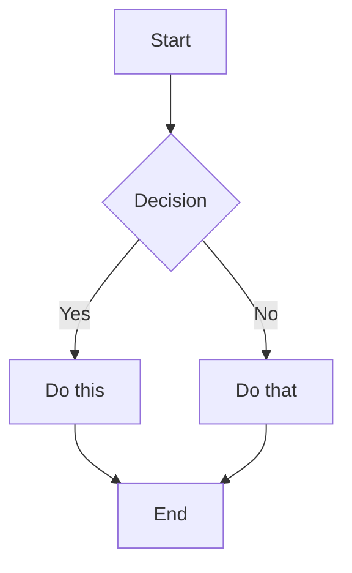
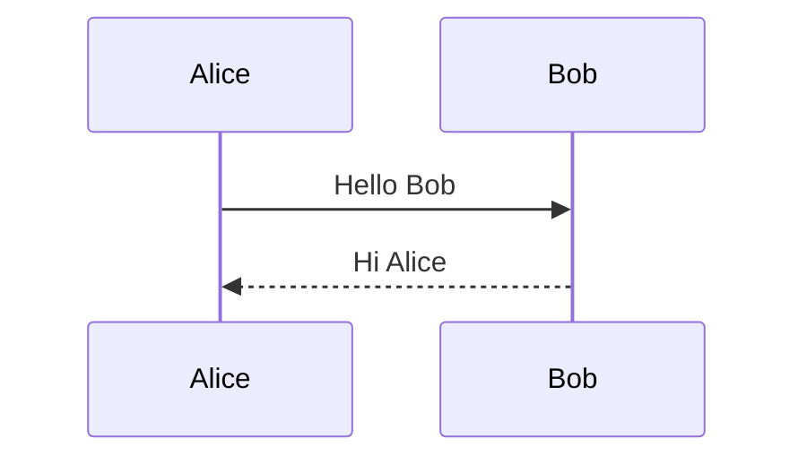

<!--
Source: Based on obsidian-skills (https://github.com/kepano/obsidian-skills) and Obsidian documentation
Last synced: See sync-status.json for authoritative sync dates
Update frequency: Check obsidian-skills and Obsidian documentation for updates
Applicability: Both (Plugin/Theme)
-->

# Obsidian File Formats and Syntax

This guide provides comprehensive information about Obsidian file formats and syntax for AI agents working on Obsidian plugins and themes. This is essential knowledge for plugins that manipulate vault files, parse Markdown, or work with Obsidian-specific formats.

## Overview

Obsidian supports several file formats:
- **Markdown** (`.md`) - Obsidian Flavored Markdown with extensions
- **Bases** (`.base`) - YAML-based database views
- **Canvas** (`.canvas`) - JSON Canvas format for visual canvases

## Obsidian Flavored Markdown

Obsidian uses a combination of Markdown flavors:
- [CommonMark](https://commonmark.org/)
- [GitHub Flavored Markdown](https://github.github.com/gfm/)
- [LaTeX](https://www.latex-project.org/) for math
- Obsidian-specific extensions (wikilinks, callouts, embeds, properties, etc.)

### Basic Formatting

#### Paragraphs and Line Breaks

```markdown
This is a paragraph.

This is another paragraph (blank line between creates separate paragraphs).

For a line break within a paragraph, add two spaces at the end  
or use Shift+Enter.
```

#### Headings

```markdown
# Heading 1
## Heading 2
### Heading 3
#### Heading 4
##### Heading 5
###### Heading 6
```

#### Text Formatting

| Style | Syntax | Example | Output |
|-------|--------|---------|--------|
| Bold | `**text**` or `__text__` | `**Bold**` | **Bold** |
| Italic | `*text*` or `_text_` | `*Italic*` | *Italic* |
| Bold + Italic | `***text***` | `***Both***` | ***Both*** |
| Strikethrough | `~~text~~` | `~~Striked~~` | ~~Striked~~ |
| Highlight | `==text==` | `==Highlighted==` | ==Highlighted== |
| Inline code | `` `code` `` | `` `code` `` | `code` |

#### Escaping Formatting

Use backslash to escape special characters:
```markdown
\*This won't be italic\*
\#This won't be a heading
1\. This won't be a list item
```

Common characters to escape: `\*`, `\_`, `\#`, `` \` ``, `\|`, `\~`

### Internal Links (Wikilinks)

Wikilinks are Obsidian's primary linking mechanism.

#### Basic Links

```markdown
[[Note Name]]
[[Note Name.md]]
[[Note Name|Display Text]]
```

#### Link to Headings

```markdown
[[Note Name#Heading]]
[[Note Name#Heading|Custom Text]]
[[#Heading in same note]]
[[##Search all headings in vault]]
```

#### Link to Blocks

```markdown
[[Note Name#^block-id]]
[[Note Name#^block-id|Custom Text]]
```

Define a block ID by adding `^block-id` at the end of a paragraph:
```markdown
This is a paragraph that can be linked to. ^my-block-id
```

For lists and quotes, add the block ID on a separate line:
```markdown
> This is a quote
> With multiple lines

^quote-id
```

#### Search Links

```markdown
[[##heading]]     Search for headings containing "heading"
[[^^block]]       Search for blocks containing "block"
```

### Markdown-Style Links

```markdown
[Display Text](Note%20Name.md)
[Display Text](Note%20Name.md#Heading)
[Display Text](https://example.com)
[Note](obsidian://open?vault=VaultName&file=Note.md)
```

**Note**: Spaces must be URL-encoded as `%20` in Markdown links.

### Embeds

#### Embed Notes

```markdown
![[Note Name]]
![[Note Name#Heading]]
![[Note Name#^block-id]]
```

#### Embed Images

```markdown
![[image.png]]
![[image.png|640x480]]    Width x Height
![[image.png|300]]        Width only (maintains aspect ratio)
```

#### External Images

```markdown


```

#### Embed Audio

```markdown
![[audio.mp3]]
![[audio.ogg]]
```

#### Embed PDF

```markdown
![[document.pdf]]
![[document.pdf#page=3]]
![[document.pdf#height=400]]
```

#### Embed Lists

```markdown
![[Note#^list-id]]
```

Where the list has been defined with a block ID:
```markdown
- Item 1
- Item 2
- Item 3

^list-id
```

#### Embed Search Results

````markdown
```query
tag:#project status:done
```
````

### Callouts

#### Basic Callout

```markdown
> [!note]
> This is a note callout.

> [!info] Custom Title
> This callout has a custom title.

> [!tip] Title Only
```

#### Foldable Callouts

```markdown
> [!faq]- Collapsed by default
> This content is hidden until expanded.

> [!faq]+ Expanded by default
> This content is visible but can be collapsed.
```

#### Nested Callouts

```markdown
> [!question] Outer callout
> > [!note] Inner callout
> > Nested content
```

#### Supported Callout Types

| Type | Aliases | Description |
|------|---------|-------------|
| `note` | - | Blue, pencil icon |
| `abstract` | `summary`, `tldr` | Teal, clipboard icon |
| `info` | - | Blue, info icon |
| `todo` | - | Blue, checkbox icon |
| `tip` | `hint`, `important` | Cyan, flame icon |
| `success` | `check`, `done` | Green, checkmark icon |
| `question` | `help`, `faq` | Yellow, question mark |
| `warning` | `caution`, `attention` | Orange, warning icon |
| `failure` | `fail`, `missing` | Red, X icon |
| `danger` | `error` | Red, zap icon |
| `bug` | - | Red, bug icon |
| `example` | - | Purple, list icon |
| `quote` | `cite` | Gray, quote icon |

### Lists

#### Unordered Lists

```markdown
- Item 1
- Item 2
  - Nested item
  - Another nested
- Item 3

* Also works with asterisks
+ Or plus signs
```

#### Ordered Lists

```markdown
1. First item
2. Second item
   1. Nested numbered
   2. Another nested
3. Third item

1) Alternative syntax
2) With parentheses
```

#### Task Lists

```markdown
- [ ] Incomplete task
- [x] Completed task
- [ ] Task with sub-tasks
  - [ ] Subtask 1
  - [x] Subtask 2
```

### Quotes

```markdown
> This is a blockquote.
> It can span multiple lines.
>
> And include multiple paragraphs.
>
> > Nested quotes work too.
```

### Code

#### Inline Code

```markdown
Use `backticks` for inline code.
Use double backticks for ``code with a ` backtick inside``.
```

#### Code Blocks

````markdown
```
Plain code block
```

```javascript
// Syntax highlighted code block
function hello() {
  console.log("Hello, world!");
}
```

```python
# Python example
def greet(name):
    print(f"Hello, {name}!")
```
````

#### Nesting Code Blocks

Use more backticks or tildes for the outer block:

`````markdown
````markdown
Here's how to create a code block:
```js
console.log("Hello")
```
````
`````

### Tables

```markdown
| Header 1 | Header 2 | Header 3 |
|----------|----------|----------|
| Cell 1   | Cell 2   | Cell 3   |
| Cell 4   | Cell 5   | Cell 6   |
```

#### Alignment

```markdown
| Left     | Center   | Right    |
|:---------|:--------:|---------:|
| Left     | Center   | Right    |
```

#### Using Pipes in Tables

Escape pipes with backslash:
```markdown
| Column 1 | Column 2 |
|----------|----------|
| [[Link\|Display]] | ![[Image\|100]] |
```

### Math (LaTeX)

#### Inline Math

```markdown
This is inline math: $e^{i\pi} + 1 = 0$
```

#### Block Math

```markdown
$$
\begin{vmatrix}
a & b \\
c & d
\end{vmatrix} = ad - bc
$$
```

#### Common Math Syntax

```markdown
$x^2$              Superscript
$x_i$              Subscript
$\frac{a}{b}$      Fraction
$\sqrt{x}$         Square root
$\sum_{i=1}^{n}$   Summation
$\int_a^b$         Integral
$\alpha, \beta$    Greek letters
```

### Diagrams (Mermaid)

````markdown

````

#### Sequence Diagrams

````markdown

````

### Footnotes

```markdown
This sentence has a footnote[^1].

[^1]: This is the footnote content.

You can also use named footnotes[^note].

[^note]: Named footnotes still appear as numbers.

Inline footnotes are also supported.^[This is an inline footnote.]
```

### Comments

```markdown
This is visible %%but this is hidden%% text.

%%
This entire block is hidden.
It won't appear in reading view.
%%
```

### Horizontal Rules

```markdown
---
***
___
- - -
* * *
```

### Properties (YAML metadata)

**Important**: Obsidian uses the term "properties" (not "frontmatter" or "front-matter") when referring to YAML metadata at the top of Markdown files. All documentation, code comments, and UI text should use "properties" to align with Obsidian's official terminology.

Properties use YAML metadata (properties) at the start of a note:

```yaml
---
title: My Note Title
date: 2024-01-15
tags:
  - project
  - important
aliases:
  - My Note
  - Alternative Name
cssclasses:
  - custom-class
status: in-progress
rating: 4.5
completed: false
due: 2024-02-01T14:30:00
---
```

#### Property Types

| Type | Example |
|------|---------|
| Text | `title: My Title` |
| Number | `rating: 4.5` |
| Checkbox | `completed: true` |
| Date | `date: 2024-01-15` |
| Date & Time | `due: 2024-01-15T14:30:00` |
| List | `tags: [one, two]` or YAML list |
| Links | `related: "[[Other Note]]"` |

#### Default Properties

- `tags` - Note tags
- `aliases` - Alternative names for the note
- `cssclasses` - CSS classes applied to the note

### Tags

```markdown
#tag
#nested/tag
#tag-with-dashes
#tag_with_underscores

In properties:
---
tags:
  - tag1
  - nested/tag2
---
```

Tags can contain:
- Letters (any language)
- Numbers (not as first character)
- Underscores `_`
- Hyphens `-`
- Forward slashes `/` (for nesting)

### HTML Content

Obsidian supports HTML within Markdown:

```markdown
<div class="custom-container">
  <span style="color: red;">Colored text</span>
</div>

<details>
  <summary>Click to expand</summary>
  Hidden content here.
</details>

<kbd>Ctrl</kbd> + <kbd>C</kbd>
```

## Obsidian Bases (.base files)

Obsidian Bases are YAML-based files that define dynamic views of notes in an Obsidian vault. A Base file can contain multiple views, global filters, formulas, property configurations, and custom summaries.

### File Format

Base files use the `.base` extension and contain valid YAML. They can also be embedded in Markdown code blocks.

### Complete Schema

```yaml
# Global filters apply to ALL views in the base
filters:
  # Can be a single filter string
  # OR a recursive filter object with and/or/not
  and: []
  or: []
  not: []

# Define formula properties that can be used across all views
formulas:
  formula_name: 'expression'

# Configure display names and settings for properties
properties:
  property_name:
    displayName: "Display Name"
  formula.formula_name:
    displayName: "Formula Display Name"
  file.ext:
    displayName: "Extension"

# Define custom summary formulas
summaries:
  custom_summary_name: 'values.mean().round(3)'

# Define one or more views
views:
  - type: table | cards | list | map
    name: "View Name"
    limit: 10                    # Optional: limit results
    groupBy:                     # Optional: group results
      property: property_name
      direction: ASC | DESC
    filters:                     # View-specific filters
      and: []
    order:                       # Properties to display in order
      - file.name
      - property_name
      - formula.formula_name
    summaries:                   # Map properties to summary formulas
      property_name: Average
```

### Filter Syntax

Filters narrow down results. They can be applied globally or per-view.

#### Filter Structure

```yaml
# Single filter
filters: 'status == "done"'

# AND - all conditions must be true
filters:
  and:
    - 'status == "done"'
    - 'priority > 3'

# OR - any condition can be true
filters:
  or:
    - 'file.hasTag("book")'
    - 'file.hasTag("article")'

# NOT - exclude matching items
filters:
  not:
    - 'file.hasTag("archived")'

# Nested filters
filters:
  or:
    - file.hasTag("tag")
    - and:
        - file.hasTag("book")
        - file.hasLink("Textbook")
    - not:
        - file.hasTag("book")
        - file.inFolder("Required Reading")
```

## JSON Canvas (.canvas files)

JSON Canvas is an open file format for infinite canvas data. Canvas files use the `.canvas` extension and contain valid JSON following the [JSON Canvas Spec 1.0](https://jsoncanvas.org/spec/1.0/).

### File Structure

A canvas file contains two top-level arrays:

```json
{
  "nodes": [],
  "edges": []
}
```

- `nodes` (optional): Array of node objects
- `edges` (optional): Array of edge objects connecting nodes

### Nodes

Nodes are objects placed on the canvas. There are four node types:
- `text` - Text content with Markdown
- `file` - Reference to files/attachments
- `link` - External URL
- `group` - Visual container for other nodes

#### Z-Index Ordering

Nodes are ordered by z-index in the array:
- First node = bottom layer (displayed below others)
- Last node = top layer (displayed above others)

#### Generic Node Attributes

All nodes share these attributes:

| Attribute | Required | Type | Description |
|-----------|----------|------|-------------|
| `id` | Yes | string | Unique identifier for the node |
| `type` | Yes | string | Node type: `text`, `file`, `link`, or `group` |
| `x` | Yes | integer | X position in pixels |
| `y` | Yes | integer | Y position in pixels |
| `width` | Yes | integer | Width in pixels |
| `height` | Yes | integer | Height in pixels |
| `color` | No | canvasColor | Node color (see Color section) |

#### Text Nodes

Text nodes contain Markdown content.

```json
{
  "id": "6f0ad84f44ce9c17",
  "type": "text",
  "x": 0,
  "y": 0,
  "width": 400,
  "height": 200,
  "text": "# Hello World\n\nThis is **Markdown** content."
}
```

#### File Nodes

File nodes reference files or attachments (images, videos, PDFs, notes, etc.).

```json
{
  "id": "a1b2c3d4e5f67890",
  "type": "file",
  "x": 500,
  "y": 0,
  "width": 400,
  "height": 300,
  "file": "Attachments/diagram.png"
}
```

#### Link Nodes

Link nodes reference external URLs.

```json
{
  "id": "b2c3d4e5f6789012",
  "type": "link",
  "x": 500,
  "y": 400,
  "width": 400,
  "height": 100,
  "url": "https://example.com"
}
```

#### Group Nodes

Group nodes are visual containers for other nodes.

```json
{
  "id": "c3d4e5f678901234",
  "type": "group",
  "x": 0,
  "y": 0,
  "width": 800,
  "height": 600,
  "label": "My Group"
}
```

### Edges

Edges connect nodes on the canvas.

```json
{
  "id": "edge-1",
  "fromNode": "node-1-id",
  "fromSide": "right",
  "toNode": "node-2-id",
  "toSide": "left",
  "color": "1",
  "label": "Connection"
}
```

## References

- [Obsidian Flavored Markdown](https://help.obsidian.md/obsidian-flavored-markdown)
- [Obsidian Bases Syntax](https://help.obsidian.md/bases/syntax)
- [JSON Canvas Specification](https://jsoncanvas.org/)
- [obsidian-skills repository](https://github.com/kepano/obsidian-skills) - Source of comprehensive syntax documentation
