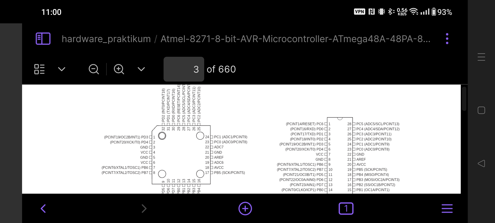
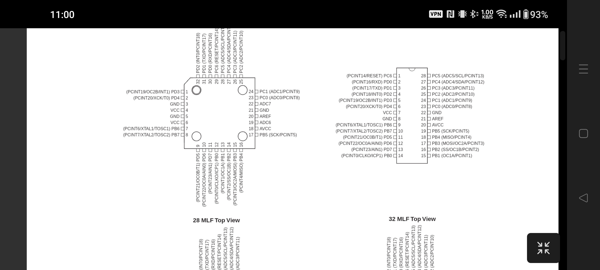
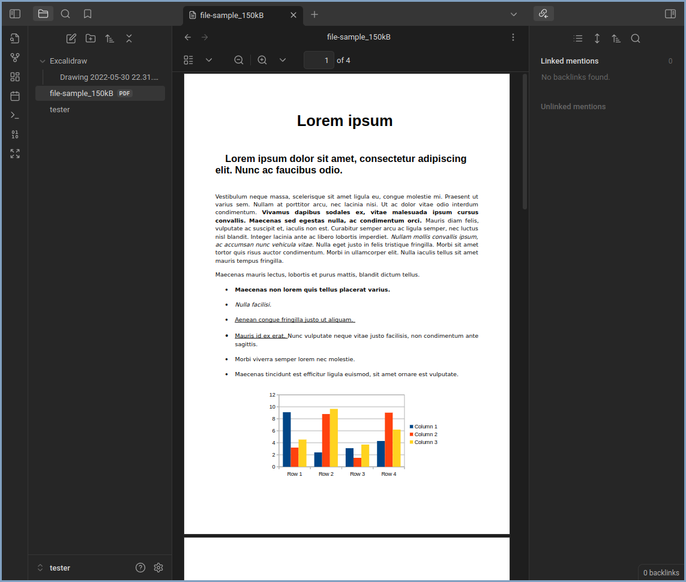
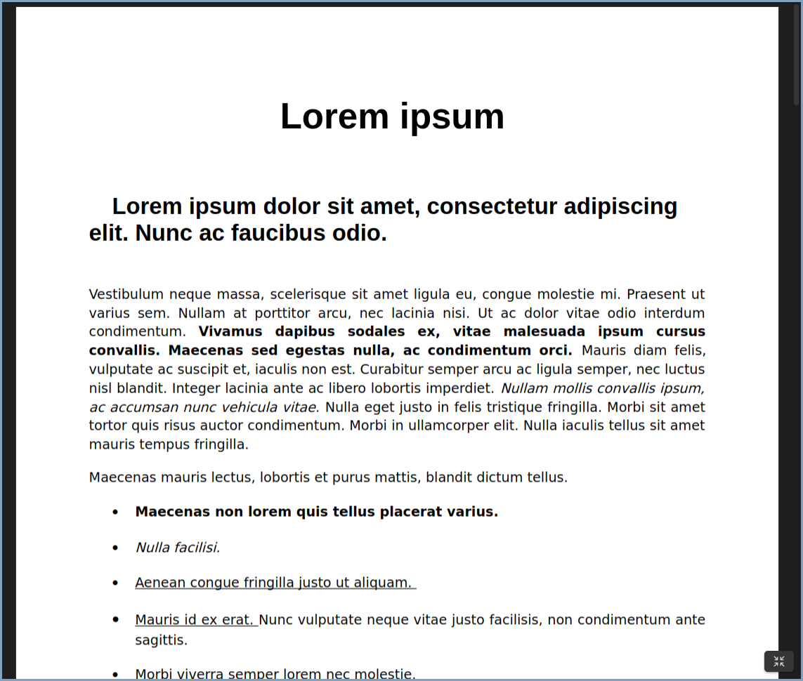

## Overview

Based on https://github.com/kepano/obsidian-hider

This plugin enables you to hide most Obsidian UI to be able to focus on the content.

## Why

Obsidian is by default unfit for content consumption or presentations. 
On mobile, viewing a PDF results in less than 40% of the screen being used for the PDF. 

Zen Mode hides all UI Elements except the current text file or document, all
that remains is a single button to restore all UI

On desktop the problem is less severe, but there is still no way to quickly
switch from an editing friendly experience to a viewing friendly experience. 
In addition to hiding all UI, zen mode also collapses and restores the side bars
when being toggled. 

## Making your theme compatible with ZenMode

ZenMode injects the `zenmode-active` class on the `body` element when zen mode is active.
